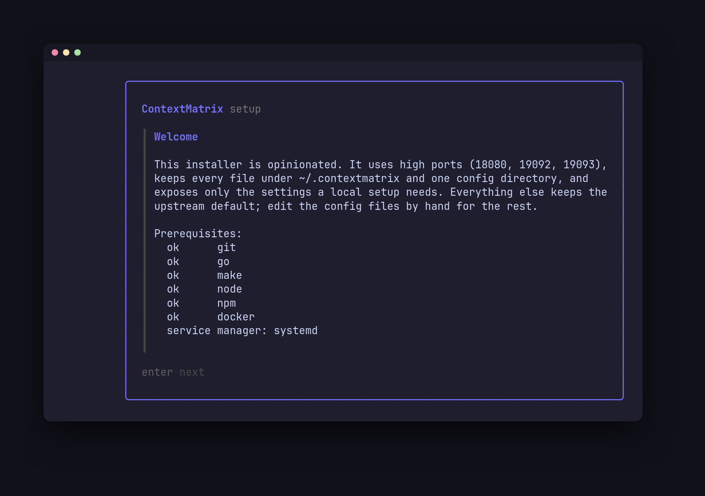

# contextmatrix-setup

Installs and updates a local ContextMatrix stack (server, agent, chat) on macOS
and Linux. No root, no sudo. One command in the morning keeps it current.

The installer is opinionated: high ports (18080, 19092, 19093), every file under
`~/.contextmatrix`, one config directory, and only the settings a local setup
needs. Everything else keeps the upstream default; edit the config files by hand
for the rest, your values are never overwritten.



## Prerequisites

### Tools

git, go (1.26 or newer), make, node and npm (server frontend build). Docker is
optional: without it the install completes, the worker images are skipped, and
the backends stay disabled until a later `update` finds docker. The welcome
screen checks all of these before the first question.

### Have these ready

The wizard asks for the items below, one screen each. With them at hand the
first install is a single sitting. Every item also has a flag, see
[Install](#install).

| Item                                       | Where to get it                                                                                                                                                                                                                                                                       |
| ------------------------------------------ | ------------------------------------------------------------------------------------------------------------------------------------------------------------------------------------------------------------------------------------------------------------------------------------- |
| **OpenRouter API key**                     | <https://openrouter.ai/keys>. Every run and chat goes through OpenRouter; the server forwards the key to the workers. Leave it empty to add it to `server.yaml` later, but nothing runs until then.                                                                                   |
| **Default model**                          | An OpenRouter model slug. The default is `deepseek/deepseek-v4-flash`. Both backends use it; chat cannot start without one.                                                                                                                                                           |
| **GitHub credential**                      | A GitHub App or a personal access token, see below. Without one the server does not start.                                                                                                                                                                                            |
| **Artificial Analysis API key** (optional) | Create an account at <https://artificialanalysis.ai> (free tier) and generate a key on your account page. Gives the model selector live quality scores.                                                                                                                               |
| **Boards repo URL** (optional)             | The `https://` URL of a GitHub repo the credential above can push to, for example `https://github.com/you/contextmatrix-boards.git`. Create it empty; the server clones it and pushes the first board. Without a URL the boards live in a local repo under `~/.contextmatrix/boards`. |
| **Task-skills repo URL** (optional)        | The `https://` URL of a repo of task skills the agents read. Without one the agents read an empty local directory.                                                                                                                                                                    |

**GitHub App or PAT?** Pick the App on a personal GitHub account: you create
and install it yourself, workers receive one-hour tokens scoped to the repos
you pick, and nothing long-lived leaves the server. Pick a PAT on a corporate
account, where creating an App usually needs an organisation admin and a token
needs only you.

- **App**: have the App ID, the installation ID and the downloaded private key
  (`.pem` file) ready; the installer copies the key under `~/.contextmatrix`.
  Install the App on the boards repo, the task-skills repo and every project
  repo. Creation steps and the permission list are in
  [github-auth-setup.md](https://github.com/mhersson/contextmatrix/blob/main/docs/github-auth-setup.md).
- **PAT**: a classic token with the `repo` scope, or a fine-grained one with
  the permissions listed in the same document. The wizard opens GitHub's
  new-token page with the `repo` scope prefilled, so this is the one item you
  can create mid-wizard.

The remaining questions (login mode, ports, services) have defaults that suit
a laptop.

## Install

```bash
go install github.com/mhersson/contextmatrix-setup@latest
contextmatrix-setup install
```

The wizard explains each step. Every answer also has a flag; `--yes` runs
without prompts:

```bash
contextmatrix-setup install --yes --auth-mode none --github-mode pat --github-pat "$TOKEN" --openrouter-key "$KEY"
```

In `multi` login mode the installer opens the one-time link that creates the
first admin account.

## Every morning

```bash
contextmatrix-setup update
```

Pulls the four repos, shows what changed, rebuilds what moved, syncs your config
files with upstream (new keys added, removed keys dropped with a note, your
values kept), rebuilds a worker image only when its repo moved, and restarts
only what changed. `--yes` skips the confirmation.

## Other commands

| Command     | Effect                                                                                  |
| ----------- | --------------------------------------------------------------------------------------- |
| `status`    | Installed and cached commits, ports, services, images                                   |
| `migrate`   | Move an install from the apps' default locations under `~/.contextmatrix`, then install |
| `uninstall` | Remove services only; configs, state and binaries stay                                  |

`migrate` moves the old config and state files to their new locations and keeps
every value: keys, GitHub credentials, ports, model and repositories found in
the old config are carried over, and the wizard asks only for what the old
install never had. Boards and task-skills checkouts move only when asked
(`--move-repos` with `--yes`). Shipped
workflow skills under `~/.contextmatrix/workflow-skills` are refreshed from
upstream at the install that follows migration, so save a customised copy of a
shipped skill under its own name before migrating. Files that do not exist
upstream are never touched.

## Where things live

| Purpose                     | Path                                                                    |
| --------------------------- | ----------------------------------------------------------------------- |
| Configs                     | `~/.config/contextmatrix/{server,agent,chat}.yaml`                      |
| State, boards, skills, logs | `~/.contextmatrix/`                                                     |
| Installer record            | `~/.contextmatrix/setup/state.yaml`                                     |
| Source cache                | `~/.cache/contextmatrix-setup/src/`                                     |
| Binaries                    | `$GOBIN` or `$(go env GOPATH)/bin`                                      |
| Units                       | `~/.config/systemd/user/` or `~/Library/LaunchAgents/`                  |
| Service logs                | `journalctl --user -u contextmatrix` or `~/Library/Logs/contextmatrix/` |

Units are installer-owned. On Linux, customise with
`systemctl --user edit <name>`; the installer never touches drop-ins. On macOS
edit the config file, not the plist. launchd loads every plist in
`~/Library/LaunchAgents` at login, so a service the installer did not start
(GitHub skipped, invalid config, no docker) still starts at the next login until
the cause is fixed and `contextmatrix-setup update` is run.

## Config files

The installer manages the key set; you own the values. Each file starts with a
header saying so and naming the upstream example file that documents every key.
Comments are not preserved, so keep notes elsewhere. Paths are
written absolute: the agent and chat do not expand `~`, and the server does so
only for some keys.

The schema comes from each app's own `config defaults` command, so a fresh
upstream key appears at the next update and a removed one is dropped and listed
in the output. A value that fails the app's validation is reported with the key
path and that service is not restarted; fix it and rerun.

## Development

```bash
make test               # unit tests
make test-integration   # end-to-end with stub tools, no network
make lint
```

`CONTEXTMATRIX_SETUP_REPO_BASE=<dir>` makes the binary clone from
`<dir>/<repo>.git` instead of GitHub; the integration tests use it. The
integration suite asserts systemd behaviour and skips itself on macOS; the smoke
checklist below covers launchd.

## macOS smoke checklist

Run after changes to services or images; CI covers Linux only.

1. `contextmatrix-setup install` on a machine with Docker Desktop or OrbStack;
   confirm the plists load
   (`launchctl print gui/$UID/com.github.mhersson.contextmatrix`).
2. Confirm `DOCKER_HOST` appears in the agent plist when the docker context is
   not the default socket.
3. Confirm the agent config has
   `container_contextmatrix_url: http://host.docker.internal:<port>`.
4. `contextmatrix-setup update` after a commit in a backend repo; confirm
   `kickstart -k` restarted only that agent and the log file under
   `~/Library/Logs/contextmatrix/` continues.
5. `contextmatrix-setup uninstall`; confirm `launchctl print` no longer lists
   the three labels and the configs remain.
